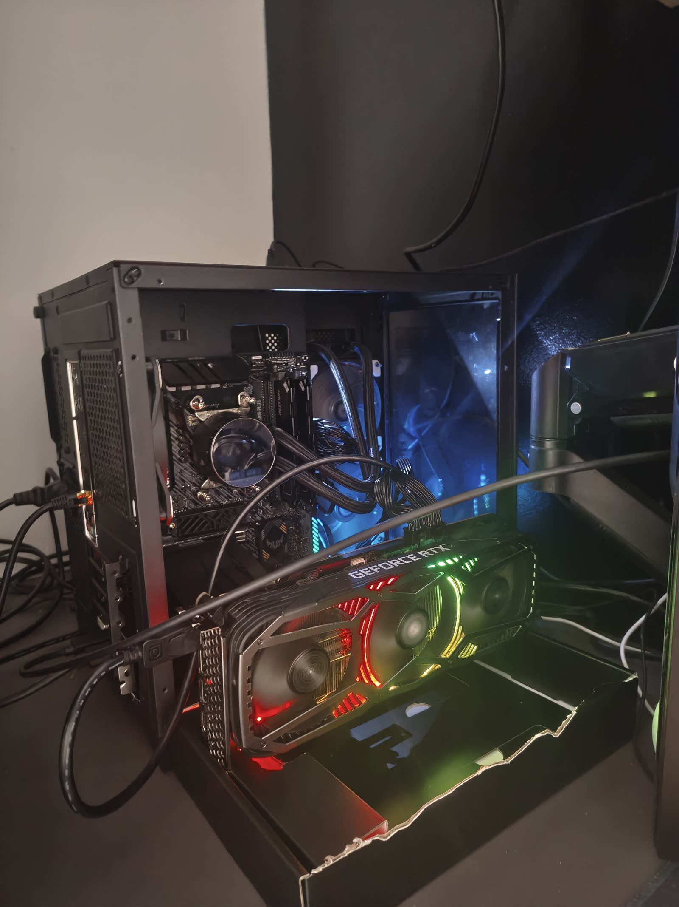
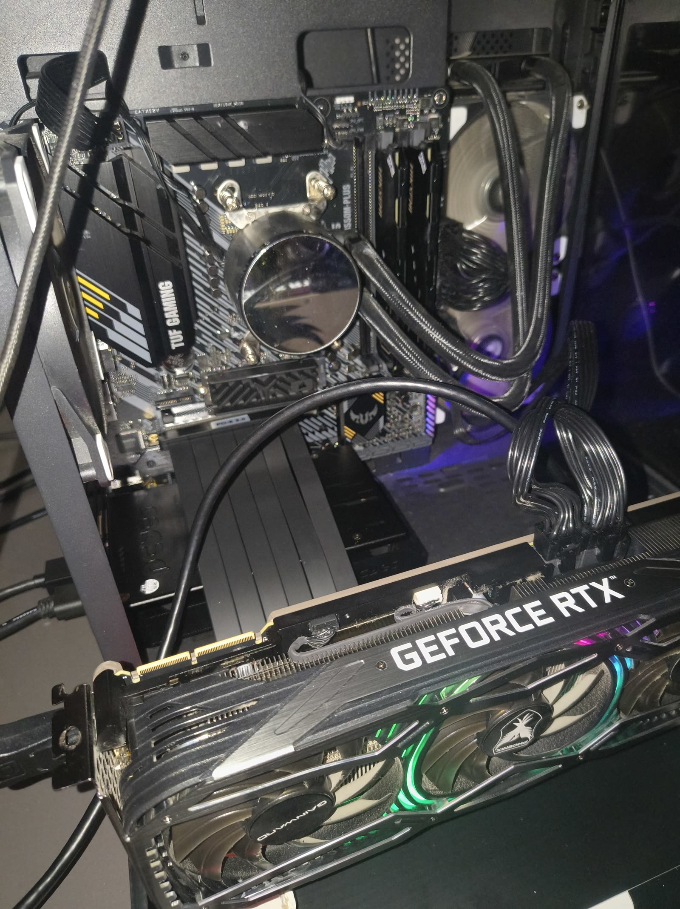
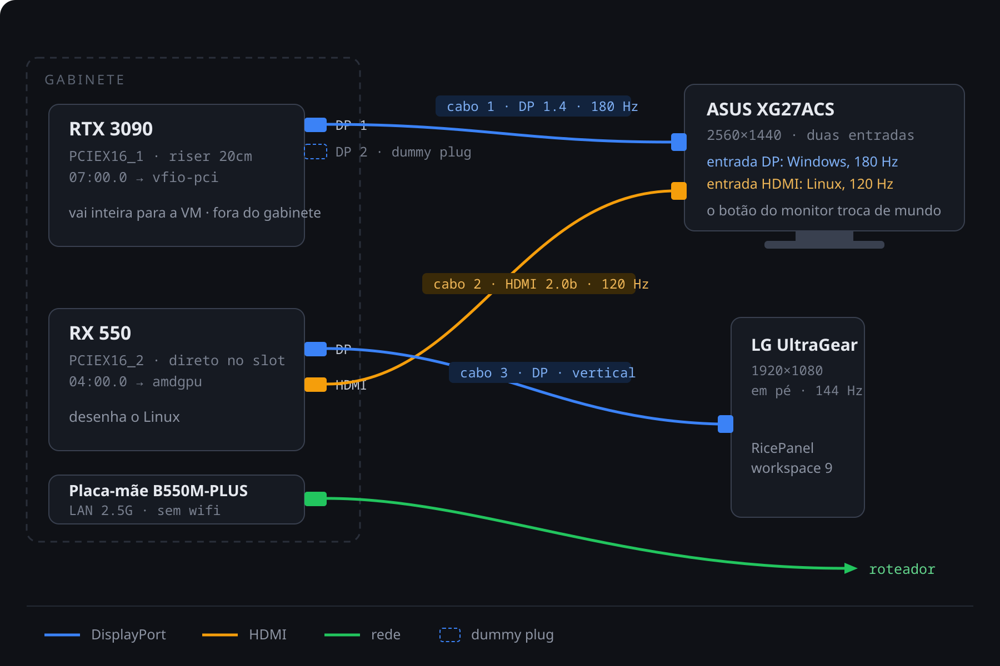

[English](README.md)

# dotfiles

Pós-instalação da máquina de desenvolvimento: **Arch Linux + Hyprland** em Wayland, com
passthrough da RTX 3090 para uma VM Windows. Cada configuração no seu pacote, linkada pelo
GNU Stow.

```
git clone https://github.com/eualexandrerrr/dotfiles ~/.dotfiles
bash ~/.dotfiles/install.sh
```

`install.sh` é idempotente. `setup.sh` reconfigura e recarrega em segundos, sem rede:

| | o quê | quando |
|---|---|---|
| `install.sh` | pacotes, driver, serviços, SDDM | mexeu no `packages.txt` |
| `setup.sh` | configura e recarrega | mexeu numa config |

Etapas: `links home perfil tema energia audio dns wallpaper console claude recarregar`.

---

## O que eu uso

| Função | Programa |
|---|---|
| Compositor / barra / lançador | `hyprland` · `waybar` · `fuzzel` |
| Notificações / bloqueio / inatividade | `swaync` · `hyprlock` · `hypridle` |
| Wallpaper / filtro noturno / OSD | `awww` · `hyprsunset` · `swayosd` |
| Arquivos | `thunar` (GUI) · `yazi` (terminal) |
| Captura | `grim` + `slurp` + `satty` |
| Terminal | `ghostty` + zsh com `starship`, `atuin`, `fzf`, `zoxide` |
| Alt+Tab / Super+Tab | `hyprexpose` (modificado) · `hyprswitch` |

---

## As cinco técnicas que sustentam tudo

**1. A config do Hyprland é Lua, não hyprlang.** O `.conf` está deprecado desde a 0.55 e na
0.56 as `windowrule` em hyprlang falham inteiras. Config errada **não dá erro na cara**: é
ignorada e a sessão sobe torta. Por isso, antes de entregar qualquer mexida:

```
Hyprland --verify-config                # responde "config ok" ou lista os erros
bash ~/.dotfiles/setup.sh recarregar    # hyprctl reload + waybar + swaync
```

A referência offline casada com a versão instalada é `/usr/share/hypr/stubs/hl.meta.lua` —
vale mais que a wiki, que descreve a versão mais nova.

**2. Monitor por marca, nunca por conector.** Trocar a placa-mãe renumera as portas, e com a
regra presa ao conector o `transform` do vertical cai no principal, a waybar sobe sem barra e
a tela de bloqueio fica sem campo de senha. Um sintoma só, quatro arquivos. Hoje nenhum
arquivo versionado guarda `DP-x`: a marca mora em `hypr/.config/hypr/telas.lua` e é resolvida
na hora — em Lua por `telas.desc()`, e fora dele por `bin/monitor.sh`. Waybar, hyprlock e
hyprswitch só aceitam nome de conector (o swaync aceita a descrição inteira do monitor),
então cada um sobe por um wrapper em `bin/` que resolve a marca e gera a config em
`$XDG_RUNTIME_DIR`.

**3. A sessão roda dentro do systemd.** O SDDM abre `hyprland-uwsm.desktop`, não o Hyprland
puro: o [uwsm](https://github.com/Vladimir-csp/uwsm) é o que faz o `graphical-session.target`
existir de verdade. Todo app da sessão sobe com `uwsm app -- <programa>`, vira um scope e
morre junto com ela em vez de virar órfão. É também no `uwsm/env` que o driver gráfico é
resolvido **lendo qual `card` é de qual GPU** — fixar `nvidia` ali joga todo app Electron em
swiftshader, renderizando por CPU.

**4. Stow com `--no-folding --restow`.** Sem o `--no-folding` o stow linka o diretório
inteiro e os apps passam a gravar dentro do repo. Pacote é a pasta com entrada começando em
ponto na raiz (`.config`, `.zshrc`); pasta sem isso é ferramenta.

**5. Nenhum keyring instalado.** Sem keyring o Chrome usa o backend `basic` (cookies `v10`) e
o perfil sobrevive ao format sem depender da senha de login. `gnome-keyring` passaria para
`v11` e criaria essa dependência — por isso não está no `packages.txt` e não deve entrar por
conveniência de app nenhum.

---

## Atalhos

| Tecla | Ação |
|---|---|
| `Meta+Return` · `Meta+R` · `Meta+E` · `Meta+B` | terminal · lançador · arquivos · navegador |
| `Meta+Q` · `Meta+F` · `Meta+T` · `Meta+V` | fechar · tela cheia · flutuar · clipboard |
| `Meta+1..9` / `Meta+Shift+1..9` | ir para workspace / mover janela |
| `Meta+setas` / `Meta+Shift+setas` / `Meta+Alt+setas` | foco / mover / redimensionar |
| `Alt+Tab` · `Super+Tab` | overview com preview · alternador |
| `Print` · `Shift+Print` · `Meta+Shift+A` · `Meta+Shift+R` | tela · recorte · anotação · gravar |
| `Meta+L` · `Meta+Shift+E` · `Ctrl+Shift+Home` | bloquear · encerrar · recarregar sessão |

Workspaces fixas por regra: **1** Chrome · **2** Discord · **3** RCode · **4** VM/Jogos ·
**6** terminais · **9** RicePanel na tela vertical.

---

## Hardware



| Peça | Modelo |
|---|---|
| CPU | Ryzen 7 5700X (8c/16t, sem vídeo integrado) |
| Placa-mãe | ASUS TUF Gaming B550M-PLUS — **sem wifi e sem bluetooth** |
| RAM | 32 GB DDR4 dual channel |
| GPU da VM | Gainward RTX 3090 24 GB — slot `PCIEX16_1` (topo, direto na CPU), **por riser** |
| GPU do host | PCYes Radeon RX 550 4 GB — slot `PCIEX16_2` (base), direto no slot |
| SSD | Corsair MP700 ELITE 932 GB, M.2 único |
| Fonte | 850 W Gold |
| Gabinete | PCYes Forcefield Mini Black Vulcan (GPU até 310 mm) |
| Monitores | ASUS XG27ACS 1440p180 (principal) · LG UltraGear 1080p144 (em pé) |

**Quem desenha o Linux é a RX 550.** A 3090 fica presa no `vfio-pci` e vai inteira para a VM
Windows.

A **3090 é que sai por riser** PCIe 3.0 x16 de 20 cm com plugue de 90°, e fica **fora do
gabinete** — ela tem 2,7 slots de cooler e não cabe junto com a outra placa. Riser com placa
desse peso pede apoio: nunca pendurada só pelo conector, que vira alavanca. A RX 550 vai
**direto no slot de baixo**, sem riser e sem alimentação extra: puxa os 75 W do próprio slot.



A 3090 fica sozinha no **grupo IOMMU 16** com o áudio dela, então o passthrough não precisa de
ACS override. A RX 550 não serve para isso: o slot de baixo pendura no chipset, atrás da mesma
bridge do grupo 15, que leva USB, SATA e a Ethernet junto.

---

## Gabarito dos cabos

São 2 cabos DisplayPort, 2 HDMI e 1 de rede. O ASUS recebe **duas** entradas e alterna pelo
botão: no dia a dia fica no HDMI (Linux), e para jogar troca para DP (Windows nativo). **A
sessão não cai em nenhum dos dois casos.**



| Cabo | De | Para | Serve para |
|---|---|---|---|
| DisplayPort | RTX 3090 | ASUS XG27ACS · entrada **DP** | Windows nativo, 2560x1440@180 |
| HDMI | RX 550 | ASUS XG27ACS · entrada **HDMI** | Linux no dia a dia, 2560x1440@120 |
| DisplayPort | RX 550 | LG UltraGear (girado) | RicePanel, 1920x1080@144 |
| Dummy plug | RTX 3090 · DP livre | — | mantém display ativo na VM |
| Rede | LAN 2.5G da placa-mãe | roteador | **único caminho: não há wifi** |

**Vídeo primário na BIOS: `PCIEX16_2`** (a RX 550), em Advanced › Onboard Devices
Configuration. É onde vive o Linux e o menu do systemd-boot — a entrada de recuperação só
serve se aparecer na tela que você usa todo dia.

**Por que o Linux fica em 120 Hz:** 1440p@180 pede ~19,3 Gbps. A DP 1.4 dá 25,9 e passa; a
HDMI 2.0b da RX 550 dá 18 e não passa. Foi decisão consciente para deixar a DP na 3090 — no
Windows o resultado é idêntico. Por isso o `monitores.lua` pede `@120` no principal, e
`mode = "highrr"` **não** resolve: ele maximiza a taxa e não a resolução, e derruba a tela
para 1024x768@180.

O dummy plug não é só para o caso de faltar cabo: com o ASUS ligado nas duas placas e a
entrada dele no HDMI, o monitor pode derrubar o hot-plug detect da DP, e aí o Windows para de
gerar frame no meio do jogo.

A VM tem documentação própria em [`vm/README.md`](vm/README.md).

---

## Quando o desktop não sobe

| Comando | O que faz |
|---|---|
| `dot status` | confere link do `hyprland.lua`, binários, sddm, autologin, serviços |
| `dot telas` | GPUs, driver de cada `card`, saídas conectadas, `AQ_DRM_DEVICES` em uso |
| `dot erros` / `dot log` | avisos da última instalação / log inteiro (`-f` acompanha) |
| `dot instalar` / `dot zero` | `git pull` + reinstala / apaga tudo e clona do zero |

Log em `~/.local/state/dotfiles/install.log`. Se nem isso resolver — compositor que não sobe
deixa você numa tty, e tty sem rede não tem saída — o caminho é o pendrive: **opção 4** do
menu do live reinstala os dotfiles sem formatar nada.

### Pegadinhas

- `hyprctl keyword` não existe mais. Para mudar config em runtime, `hyprctl dispatch` com
  função Lua.
- `hyprctl reload` não recarrega a waybar, e `SIGUSR2` não basta se ela subiu sem barra
  nenhuma: o `setup.sh recarregar` mata e sobe de novo.
- `transform = 1` é 90°. Se a tela vertical sair de cabeça para baixo, o valor certo é `3`.
- O shell é zsh: `for p in $var` não faz word splitting. Use array ou `bash -c`.
- `pacman -Q` mente sobre pacote instalado nesta máquina. Use `command -v` para binário e
  `pacman -Si` para saber se existe nos repos.

---

## Créditos

O overview do `Alt+Tab` é o **[hyprexpose](https://github.com/ThiagoAVicente/hyprexpose)**, de
ThiagoAVicente, sob licença MIT. Este repo usa uma **versão modificada**: `pacotes/hyprexpose/`
compila o upstream com o patch `0001-ignorar-monitores-e-alt-tab.patch`, que adiciona a chave
`ignore_monitors` (ausente no original) para deixar o monitor vertical de fora, ensina o
overlay a ler `Tab` e o release do Alt na própria surface, e fixa o grid em uma linha só.
Nada mais foi alterado.

O alternador do `Super+Tab` é o **[hyprswitch](https://github.com/egnrse/hyprswitch)** (fork de
[H3rmt/hyprshell](https://github.com/H3rmt/hyprshell)), MIT, usado sem modificação.
